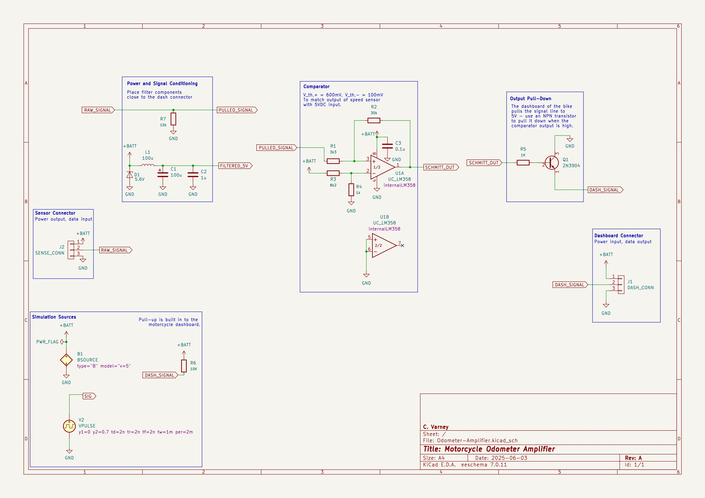
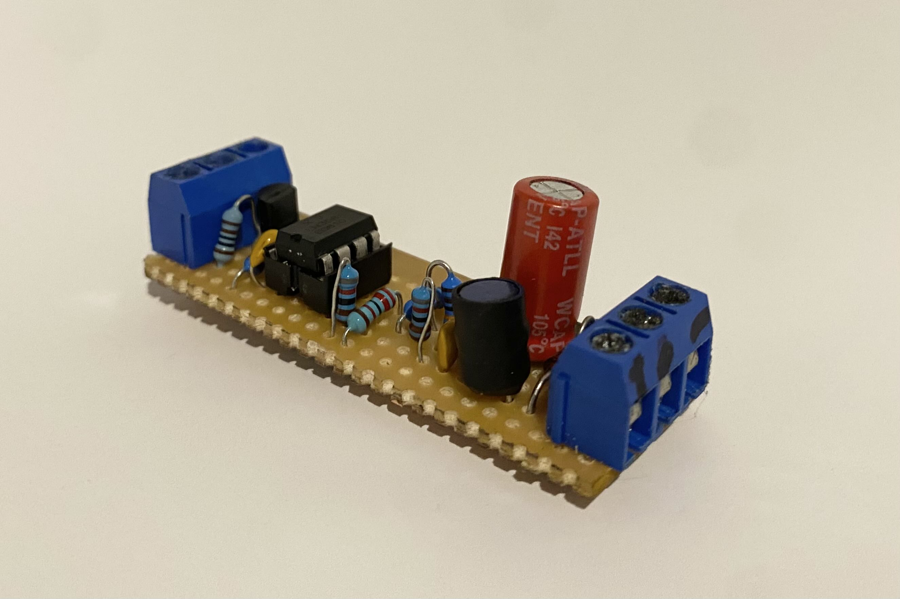

# Motorcycle Odometer Amplifier

Interface between a digital hall effect vehicle speed / odometer sensor and a motorcycle dashboard, which require different logic levels.

The dashboard and sensor are part of a Chinese clone of a Honda CBR250RR Clone. The previous owner replaced the vehicle speed sensor with an incompatible component. The sensor, when provided with 5V, outputs 600mVp-p square wave on the signal line. The dashboard expects 5Vp-p, and has it's signal line pulled up to 5V by default - the pull-down of the sensor is not strong enough to bring this to logic low.

Using a Schmitt trigger implemented with an LM358 op-amp, the 600mVp-p signal is amplified to ~3.5Vp-p. This voltage now exceeds the threshold required to drive an NPN transistor, which is used to pull the signal line of the dashboard down. 

The dashboard provides a "regulated" 5V for these components, but with ~400mV ripple. A Zener diode was added to clamp over-voltage, and a LC low-pass filter was included.

The design was implemented on strip-board, had larger components secured with hot glue to prevent vibration damage, and installed in a off-the-shelf plastic enclosure on the bike.

